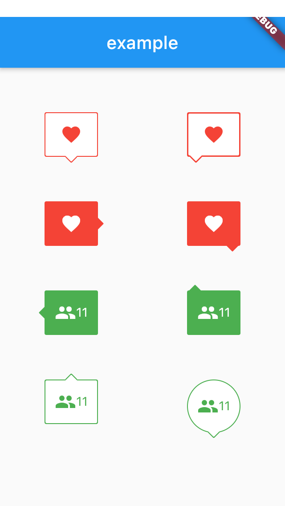

# speech_balloon

A flutter widget that emulates a speech balloon.

This widget is a copy of https://pub.dev/packages/speech_balloon

I created this because the previous creator doesn't seem to have updated it.

Changes from speech_balloon include the ability to display a border.


# Installing

Dart Pub: https://pub.dartlang.org/packages/speech_balloon#-installing-tab-

1. Depend on it

   Add this to your package's pubspec.yaml file:

```dependencies:
  speech_balloon: ^0.0.1
```

2. Install it

   You can install packages from the command line:

```
$ flutter packages get
```

Alternatively, your editor might support flutter packages get. Check the docs for your editor to learn more.

3. Import it

Now in your Dart code, you can use:

```
import 'package:speech_balloon/speech_balloon.dart';
```

# Usage

Creates a widget that emulates a speech balloon.
Could be used for a tooltip, or as a pop-up notification, etc.

<div class="center">
    
  </div>


# Example Code

```dart
import 'package:flutter/material.dart';
import 'package:speech_balloon/speech_balloon.dart';

void main() => runApp(MyApp());

class MyApp extends StatefulWidget {
  @override
  _MyAppState createState() => _MyAppState();
}

class _MyAppState extends State<MyApp> {
  @override
  Widget build(BuildContext context) {
    return MaterialApp(
      home: Scaffold(
        appBar: AppBar(
          title: const Text('example'),
        ),
        body: Center(
          child: Row(
            mainAxisAlignment: MainAxisAlignment.spaceAround,
            children: [
              Column(
                children: [
                  SizedBox(height: 50),
                  SpeechBalloon(
                    nipLocation: NipLocation.bottom,
                    borderColor: Colors.red,
                    color: Colors.white,
                    child: Icon(
                      Icons.favorite,
                      color: Colors.red,
                    ),
                  ),
                  SizedBox(height: 50),
                  SpeechBalloon(
                    nipLocation: NipLocation.right,
                    color: Colors.red,
                    child: Icon(
                      Icons.favorite,
                      color: Colors.white,
                    ),
                  ),
                  SizedBox(height: 50),
                  SpeechBalloon(
                    nipLocation: NipLocation.left,
                    color: Colors.green,
                    child: Row(
                      mainAxisAlignment: MainAxisAlignment.center,
                      children: [
                        Icon(
                          Icons.people,
                          color: Colors.white,
                        ),
                        Text(
                          '11',
                          style: TextStyle(color: Colors.white),
                        ),
                      ],
                    ),
                  ),
                  SizedBox(height: 50),
                  SpeechBalloon(
                    nipLocation: NipLocation.top,
                    borderColor: Colors.green,
                    child: Row(
                      mainAxisAlignment: MainAxisAlignment.center,
                      children: [
                        Icon(
                          Icons.people,
                          color: Colors.green,
                        ),
                        Text(
                          '11',
                          style: TextStyle(color: Colors.green),
                        ),
                      ],
                    ),
                  ),
                ],
              ),
              Column(
                children: [
                  SizedBox(height: 50),
                  SpeechBalloon(
                    nipLocation: NipLocation.bottomLeft,
                    borderColor: Colors.red,
                    color: Colors.white,
                    borderWidth: 3,
                    child: Icon(
                      Icons.favorite,
                      color: Colors.red,
                    ),
                  ),
                  SizedBox(height: 50),
                  SpeechBalloon(
                    nipLocation: NipLocation.bottomRight,
                    color: Colors.red,
                    child: Icon(
                      Icons.favorite,
                      color: Colors.white,
                    ),
                  ),
                  SizedBox(height: 50),
                  SpeechBalloon(
                    nipLocation: NipLocation.topLeft,
                    color: Colors.green,
                    child: Row(
                      mainAxisAlignment: MainAxisAlignment.center,
                      children: [
                        Icon(
                          Icons.people,
                          color: Colors.white,
                        ),
                        Text(
                          '11',
                          style: TextStyle(color: Colors.white),
                        ),
                      ],
                    ),
                  ),
                  SizedBox(height: 50),
                  SpeechBalloon(
                    nipLocation: NipLocation.bottom,
                    borderColor: Colors.green,
                    height: 60,
                    width: 60,
                    borderRadius: 40,
                    offset: Offset(0, -1),
                    child: Row(
                      mainAxisAlignment: MainAxisAlignment.center,
                      children: [
                        Icon(
                          Icons.people,
                          color: Colors.green,
                        ),
                        Text(
                          '11',
                          style: TextStyle(color: Colors.green),
                        ),
                      ],
                    ),
                  ),
                ],
              ),
            ],
          ),
        ),
      ),
    );
  }
}
```
